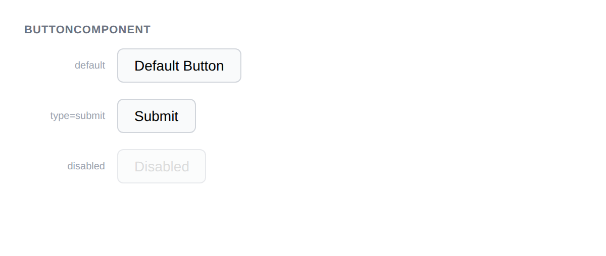

# ButtonComponent



## Usage

```php
$button = new ButtonComponent();
$button->addChild('Click me');
$button->getMarkup();
// <button type="button">Click me</button>
```

## Variants

```php
// Submit button
$button = new ButtonComponent();
$button->setType('submit');
$button->addChild('Submit');

// Disabled button (adds disabled + aria-disabled="true")
$button = new ButtonComponent();
$button->addChild('Disabled');
$button->disable();

// Re-enable
$button->enable();
```

## Inherited methods

All [TokenComponent](../TokenComponent.php) methods are available: `addClass()`, `addAttribute()`, `addChild()`, `addDecorator()`, etc.
