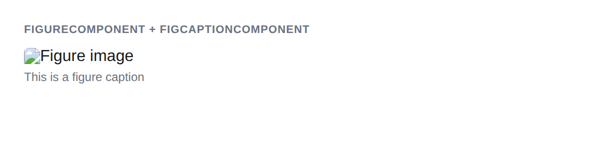

# FigureComponent + FigCaptionComponent



## Usage

```php
$figure = new FigureComponent();
$image = new ImageComponent();
$image->setSrc('photo.jpg')->setAlt('Photo');
$figure->addChild($image->getMarkup());

$caption = new FigCaptionComponent();
$caption->setCaption('Photo caption');
$figure->addChild($caption->getMarkup());

$figure->getMarkup();
// <figure><figcaption>Photo caption</figcaption></figure>
```

## Inherited methods

All [TokenComponent](../TokenComponent.php) methods are available.
