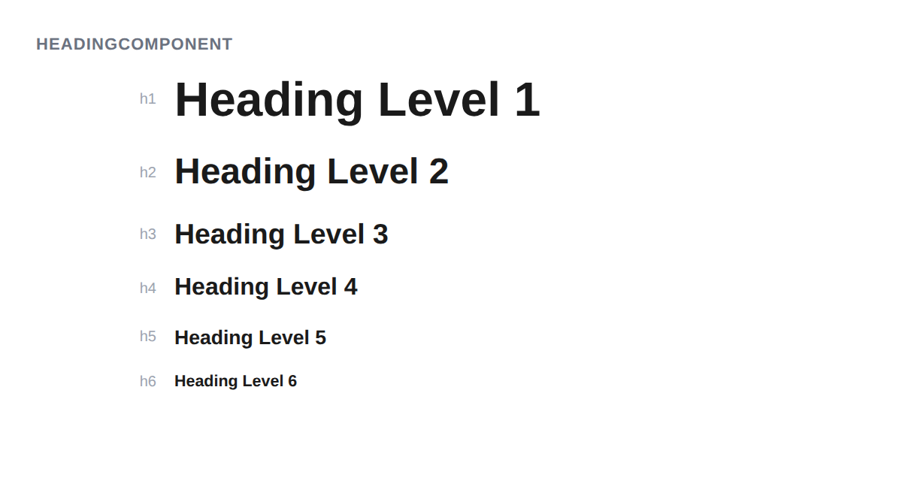

# HeadingComponent



## Usage

```php
$heading = new HeadingComponent();
$heading->setLevel(1);
$heading->addChild('Page Title');
$heading->getMarkup();
// <h1>Page Title</h1>
```

## Validation

Level must be between 1 and 6. An exception is thrown for invalid levels.

```php
$heading->setLevel(0); // throws Exception
$heading->setLevel(7); // throws Exception
```

## Default

The default level is `2` (`<h2>`).

## Inherited methods

All [TokenComponent](../TokenComponent.php) methods are available.
