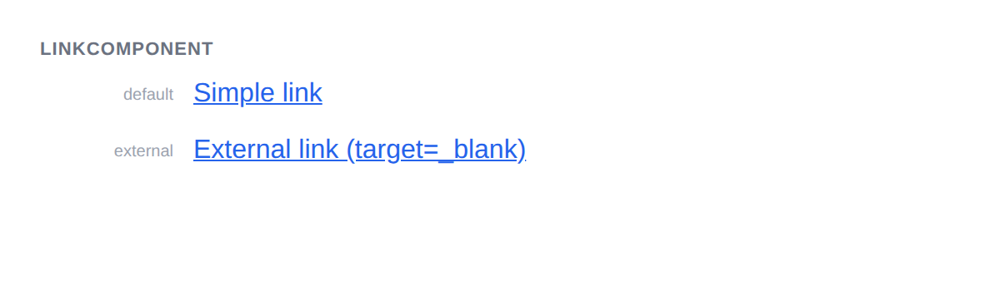

# LinkComponent



## Usage

```php
$link = new LinkComponent();
$link->setHref('https://example.com');
$link->addChild('Visit Example');
$link->getMarkup();
// <a href="https://example.com">Visit Example</a>
```

## Validation

The `href` attribute is required. An `InvalidArgumentException` is thrown if `getMarkup()` is called without setting `href`.

## Options

```php
// External link
$link = new LinkComponent();
$link->setHref('https://example.com');
$link->setTarget('_blank');
$link->setRel('noopener noreferrer');
$link->addChild('External link');
```

## Inherited methods

All [TokenComponent](../TokenComponent.php) methods are available.
