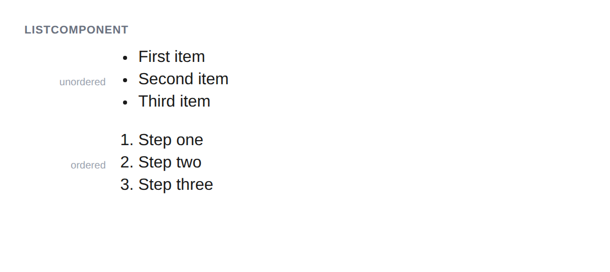

# ListComponent



## Usage

```php
// Unordered list (default)
$list = new ListComponent();
$li = new ListItemComponent();
$li->addChild('First item');
$list->addChild($li->getMarkup());
$list->getMarkup();
// <ul><li>First item</li></ul>

// Ordered list
$list = new ListComponent();
$list->ordered(true);
$list->setStart(3); // Optional: start numbering from 3
```

## Inherited methods

All [TokenComponent](../TokenComponent.php) methods are available.
