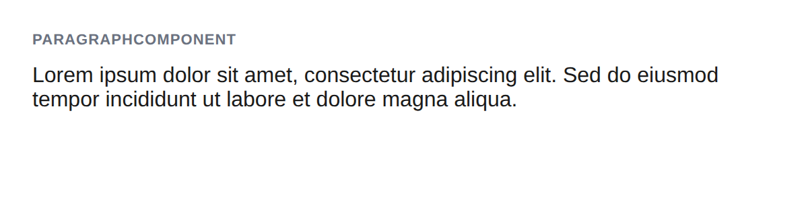

# ParagraphComponent



## Usage

```php
$p = new ParagraphComponent();
$p->addChild('Lorem ipsum dolor sit amet.');
$p->getMarkup();
// <p>Lorem ipsum dolor sit amet.</p>
```

## Inherited methods

All [TokenComponent](../TokenComponent.php) methods are available.
